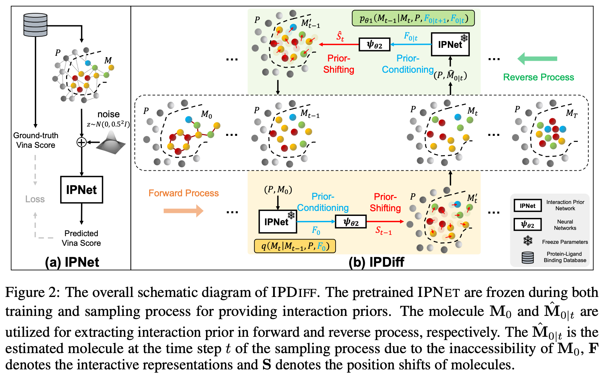

# IPDiff-ICLR 2024
Official implementation for our ICLR 2024 paper [Protein-Ligand Interaction Prior for Binding-aware 3D Molecule Diffusion Models](https://openreview.net/forum?id=qH9nrMNTIW).

The current repo only contains evaluation code, and we will update training and sampling code in **2024.2.21**.



## Environment
Python 3.8

PyTorch 1.10.1

CUDA 11.3

PyTorch Geometric 2.0.4

RDKit 2022.03.5

```
cd ./IPDiff
conda env create -f ipdiff.yaml
# For Vina Docking
pip install meeko==0.1.dev3 scipy pdb2pqr vina==1.2.2
python -m pip install git+https://github.com/Valdes-Tresanco-MS/AutoDockTools_py3
```

## Training, Sampling and Evaluation
To be updated in **2024.2.21**

## Citation
```
@inproceedings{
huang2024proteinligand,
title={Protein-Ligand Interaction Prior for Binding-aware 3D Molecule Diffusion Models},
author={Zhilin Huang and Ling Yang and Xiangxin Zhou and Zhilong Zhang and Wentao Zhang and Xiawu Zheng and Jie Chen and Yu Wang and Bin CUI and Wenming Yang},
booktitle={International Conference on Learning Representations},
year={2024}
}
```